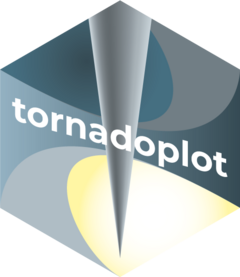

<!-- README.md is generated from README.Rmd. Please edit that file -->

```{r, include = FALSE}
knitr::opts_chunk$set(
  collapse = TRUE,
  comment = "#>",
  fig.path = "man/figures/README-"
)
```

# tornadoplot 

<!-- badges: start -->
[](https://CRAN.R-project.org/package=tornadoplot)
[](https://lifecycle.r-lib.org/articles/stages.html#experimental)
<!-- badges: end -->

A tornadoplot\* is a heatmap of coverage from genome wide assays centred at several features. The depth of coverage is encoded in a sequential colour scale. Every row in the heatmap is a genomic locus and every column is a position relative to the centre of some feature. Arranging the rows from high to low coverage gives this heatmap a characteristic shape resembling a tornado. This type of plot is common in the epigenetics and chromatin fields of molecular biology.

The {tornadoplot} package facilitates making these types of heatmaps in R with Bioconductor infrastructure. It can use precalculated coverage data from [bigwig](https://genome.ucsc.edu/goldenpath/help/bigWig.html) files, or calculate coverage *de novo* from [tabix](http://www.htslib.org/doc/tabix.html) files or `GRanges` objects in R. The data can then be plotted with help from the {ggplot2} package. Why does this package exist? Well, because other packages aren't doing things quite the way I want them to be done.

\* This is not a widely used term. It is just more imaginative than yet another type of 'heatmap', which may display anything really.

## Installation

You can install the development version from [GitHub](https://github.com/) with:

``` r
# install.packages("devtools")
devtools::install_github("teunbrand/tornadoplot")
```
## Example

This is a basic example which shows you how to make a tornado plot. First, we need to decide what data we want to plot. If you're downloading data from the internet in a script, you can use the {BiocFileCache} package to avoid repeatedly downloading data and alleviate traffic on the provider. Below, we download and cache two bigwig files from Sox2 and Oct4 ChIP-seq experiments [[1]](#1).

```{r declarefiles}
library(BiocFileCache)
bfc <- BiocFileCache()

# Declare files
# These bigwigs are derived from PMID: 28212747
sources <- c(
  "sox2" = "http://dc2.cistrome.org/genome_browser/bw/73468_treat.bw",
  "oct4" = "http://dc2.cistrome.org/genome_browser/bw/73466_treat.bw"
)
bigwigs <- setNames(bfcrpath(bfc, sources), c("Sox2 ChIP", "Oct4 ChIP"))
```

The following decision is what parts of the data to plot. For purposes of this example, the `octsox_peaks` object is a preprocessed set of genomic loci where Oct4 and Sox2 bind alone or together.

```{r makeplot, fig.width=4, fig.height=5, out.height ="100%", fig.align="center"}
library(tornadoplot)

# These are a preprocessed set of ChIP-seq peaks
feats <- octsox_peaks

# Recall that the files are named, which the next function uses for labels
bigwigs <- BigWigFileList(bigwigs)

# Give the function locations and data
tornado_plot(features = feats, data = bigwigs)
```

## Related works

* The [deepTools](https://deeptools.readthedocs.io/en/develop/) suite of python tools is perhaps best known for making these types of plots through a combination of their [computeMatrix](https://deeptools.readthedocs.io/en/develop/content/tools/computeMatrix.html) and [plotHeatmap](https://deeptools.readthedocs.io/en/develop/content/tools/plotHeatmap.html) combination.

## References
<a id="1">[1]</a>
Liu, Ziyang *et al*. (2017)
Catalytic-Independent Functions of PARP-1 Determine Sox2 Pioneer Activity at Intractable Genomic Loci.
Molecular Cell *65* **4** p589-603 https://doi.org/10.1016/j.molcel.2017.01.017
